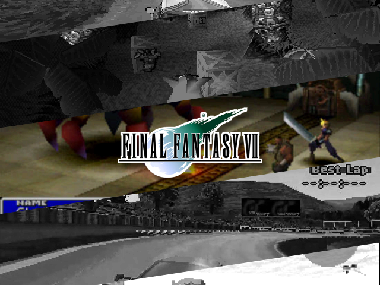

When running `make build` various options are presented.   
The process of picking options can be laborious, if you want to re-run the build process using all of the same options used on the last build you can use `make build-last` instead

### Build rom Artwork?

Will generate boxart for every rom

### Build folder Artwork?

Will generate boxart for every folder

### Force Build portmaster artwork?

This option only appears if you don't have a Ports folder in your root rom_folder.  
See [config_portmaster.yml]( ) for how to configure.

### Include a counter?

Will include a counter, if selected you can configure the style and position of the counter. The following image shows all of the positions possible to place the counter. The 'absolute' positions appear in the header or footer.

### Include a scrollbar?

Will include a 'dot' or 'bar' style scrollbar to the left or right hand side.

### Include translations?

Will include a translation bar for configured roms. See [rom_translations.yml]( )

You can choose the position of the translation

| position                                                                   |                                             | 
|----------------------------------------------------------------------------|:-------------------------------------------:|
| left top-left bottom-left right top-right bottom-right |  |
| top center-top center center-bottom bottom                 |  | 

### Remove header and footer?

This option removes 42px from the top and bottom of the image, this works well with some themes. If a counter is selected then it is inserted
_after_ this step, so the counter will remain in place

| Without Option Selected                             |             With Option Selected              | 
|-----------------------------------------------------|:---------------------------------------------:|
|  |  |

### Zip output into archive?

Will package the generated boxart into a folder located at /.zipped. The package is formatted for use with the 'Archive Manager' on muOS.

### Attempt SFTP Transfer?

This option will only appear if sftp has been configured in [config.yml]( ).
If set will attempt to transfer the artwork directly to the catalogue folder on the device. If 'Zip output into archive' then will instead copy the zip file directly into the 'ARCHVIE' folder ready for installation.