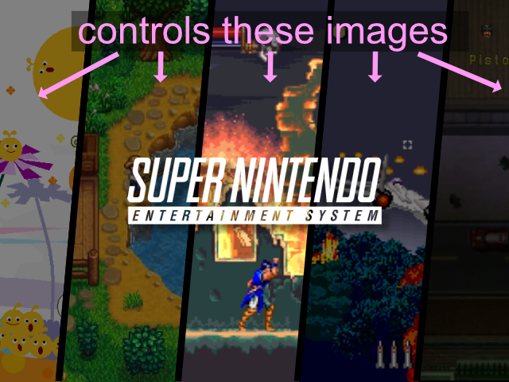

<br>

Some artwork templates will generate 'Folder' art by using as screenshot from one of the roms in your collection. If
this is not configured it will just pick the first rom it finds in the directory. By setting a configuration in this
file you can force such artwork to use a specific rom in your collection instead.

<div>
    
</div>

```yaml {filename="folder_roms.yml"}

'nes': 'Super Mario Bros. 2 (Japan) (En)'
'mastersystem': 'OutRun (World)'
'atari2600': 'Space Invaders (USA)'
'segacd': 'Snatcher (USA)'
'snes': 'Super Punch-Out!! (USA)'
'psx': 'PaRappa the Rapper (USA) (En,Fr,De,Es,It)'
```

