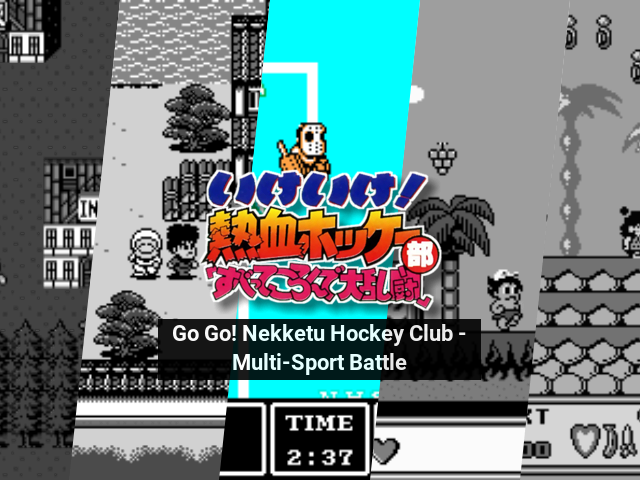

<br>

Some Template styles (e.g [Artbook Next]()) allow generated artwork to be overlaid with a 'translation'.

<div>
    
</div>

```yaml {filename="rom_translations.yml"}
"gbc":
  "Pokemon Trading Card Game 2*": "Pokemon Trading Card Game 2"
  "Shin Megami Tensei Devil Children*": "Shin Megami Tensei: Devil Children"
"snes":
  "Shin Megami Tensei II*": "Shin Megami Tensei II"
  "Shin Megami Tensei*": "Shin Megami Tensei"
  "Super Famicom Wars*": "Super Famicom Wars"
```

### Adding Translations

To add or amend a translation you can add or change an entry in this file. The 'keys' refer to the name of the rom. You can use an asterisk * as a wildcard at the end of a romname to match multiple roms.

Roms are matched in order from to bottom of this file and the first match will be used so list more specific entries first e.g

```yaml {filename="rom_translations.yml"}
'nes':
  "Wai Wai World 2*": "Wai Wai World 2 - SOS!! Parsley Castle"
  "Wai Wai World*": "Wai Wai World"
```

### Removing Translations

To file comes pre-populated with some translations. If you _dont_ want to see these
translations in your generated artwork just delete the **contents** of this file (not the file itself)