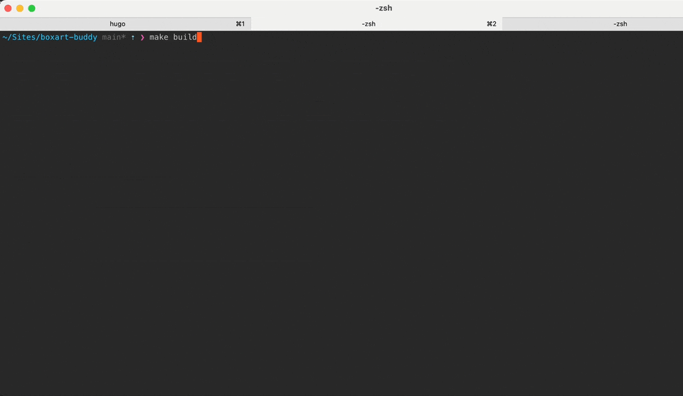


All commands should be run from the root of the boxart-buddy repository


{}

### Bootstrap

```shell
make bootstrap
```

You'll be prompted to enter the root path to 'folder_roms', which must be a folder that exists and contains subfolders with your roms in them. Boxart Buddy assumes that each folder contains roms for one platform only.

This will generate config files inside ./user_config folder.











You must edit [config.yml]( ) and [config_folder.yml]( ) before you can proceed.


Bootstrap attempts to auto generate config_folder.yml for you but there may be folders you need to map manually.


See [Configuration Reference]( ) for more details

### Scrape

```shell
make scrape
```

This process is **slow** and can take hours depending on number of roms<br>
This only needs to be done once.

### Generate

```shell
make build
```


See [templates gallery]() for previews <br/>
See [build options]() for options




Completed artwork will be output into ```./package```. <br>
See [templates transfer]()
for information on copying to device


After generating, some roms may be skipped due to not being scraped properly.
See the [skipped section]() for how to handle this


{}
