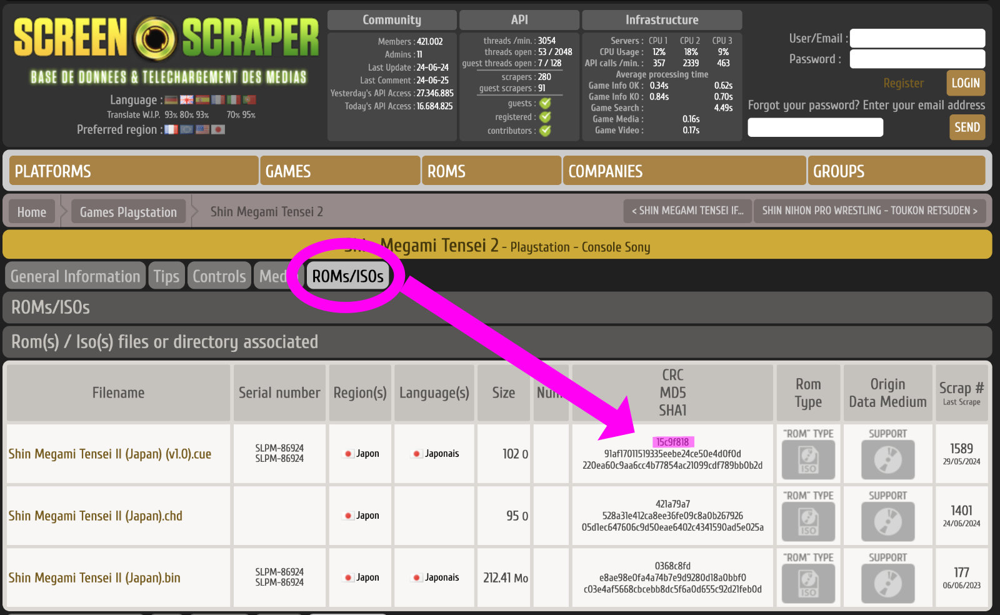

During the build/generation some roms may be missing e.g fan made translations, rom hacks or if the filename can't be matched.


You may also encounter missing artwork if you have added roms to folders since you first scraped. In that instance you just need to scrape the missing roms by running ```make scrape-missing```


Skyscraper already generates log files for these missing files.

Boxart Buddy uses these files to streamline the process of importing data for those roms that are missing.

There are two options for importing missing data, you can use either or combine both techniques.

## Import using missing.json

This mechanism is useful if skyscraper failed to match for your rom, but you are sure that the information exists within the scraping source (e.g screenscraper.fr). You can amend this file to provide information to target your roms more accurately. All roms that cannot be found will be added to a single file









```json {filename="missing.json"}
{
  "romname.zip": {
    "platform": "megadrive",
    "query": "crc="
  },
  "romname2.zip": {
    "platform": "gamegear",
    "query": "crc="
  }
}
```

You can fill this in to provide a 'crc' to target a specific game, or use a 'romnom' as follows to try and
match on 'name' instead:

```json {filename="missing.json"}
{
  "Rhythm Heaven Silver (Japan) (Translated).zip": {
    "platform": "gba",
    "query": "crc=349D7025"
  },
  "Go for it! Goemon 3 - The Mecha Leg Hold of Jurokube Shishi (Japan) (Translated).zip": {
    "platform": "snes",
    "query": "romnom=Ganbare Goemon 3"
  },
  "Mystery Dungeon 2 - Shiren the Wanderer (Japan) (Translated).zip": {
    "platform": "snes",
    "query": "romnom=Fushigi No Dungeon 2"
  }
}
```

You can get the CRC of a game from the ROMs/ISOs tab.



Once complete you can run a command to parse this file and rescrape these roms, hopefully filling the cache for all your roms.

To scrape using the file run:

``` shell
make import-missing-json
```


After processing, this file will be backed up to <br>
```./skipped/processed/{time}missing.json```


##### Sample

This is an example of 'missing.json' that could be useful if you have a particular set of roms. To use it move it
to ```./skipped/romset/missing.json``` and run the above command.

[tinybest_missing.json](  )

## Import using image/text files

This mechanism is useful if the roms you are trying to import **DO NOT**
have data in the scraping source. In this case you need to provide it yourself.

For all missing roms a folder structure is created automatically containing 'dummy files':






















You need to replace these default images with your own content. MAKE SURE THE FILENAMES ARE NOT ALTERED. If you are providing a wheel image make sure it has a transparent background for best results. After editing you can run the following command to import into the skyscraper cache

``` shell
make import-missing-files
```


After processing, all imported files will be moved to <br>
```./temp/import-files-bak/{time}/*```
