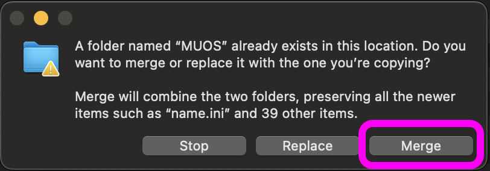

### Package Output

After the build process is complete you'll need to transfer your generated boxart to your device.
The generated artwork should be in the root of the boxart-buddy folder here:































You need to copy the 'MUOS' folder and all its contents to the **root** of your SD1 card. <br>
BE AWARE that you don't want to **overwrite** the MUOS folder, but **merge**. This is the default behaviour on
windows, but on macOS you need to make sure you click 'merge' and not 'replace' in the following dialog

<div >
</div>

### Transfer

If you have setup your device for sftp and [configured the IP address](/configuration/reference/config.yml/#ip) you can
use the 'transfer' option when generating. This will
automatically transfer artwork onto your device in the correct location.

### Zip

If you chose the 'zip' option, the artwork will be packaged into a zip file saved to the ```./zipped``` folder.
<br><br>
If you select 'transfer' as well as 'zip', then this file will be copied into the 'ARCHIVE' folder on the device. This is the best option for storing multiple sets of artwork on your device as you can then simply use the 'Archive Manager' on the device to install the artwork.